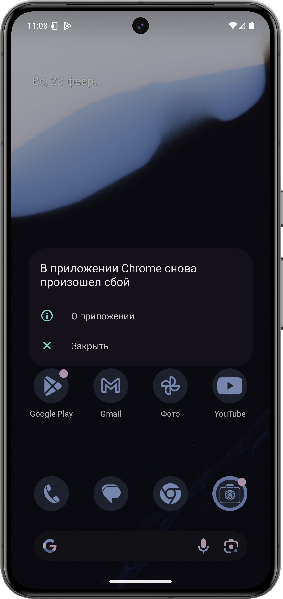
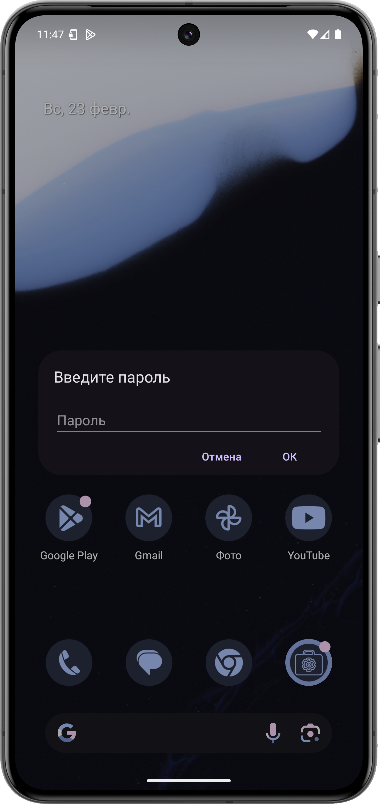
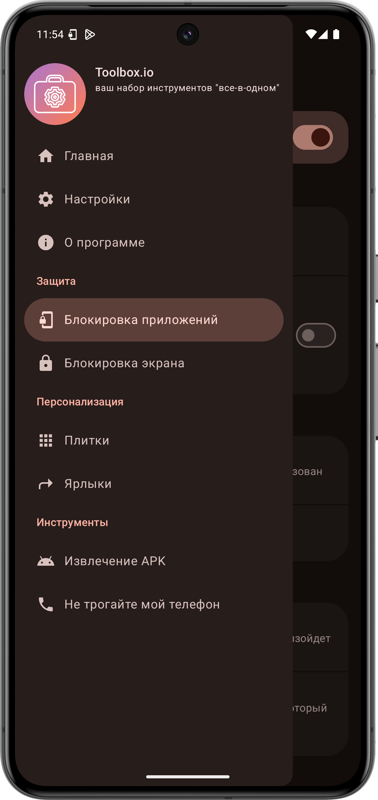
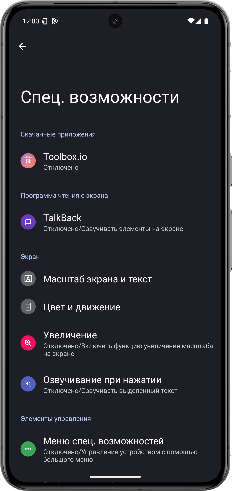
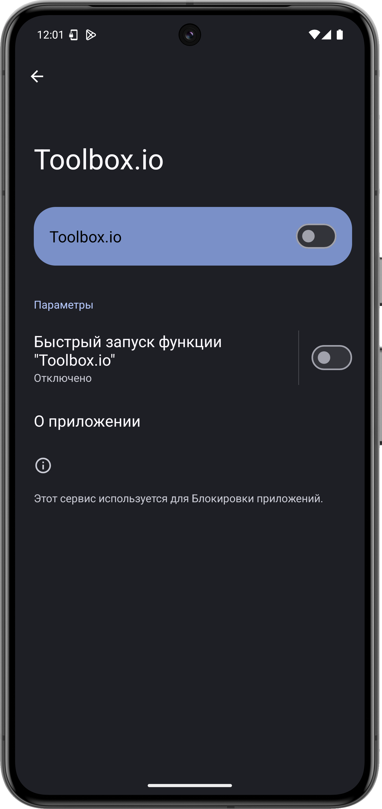
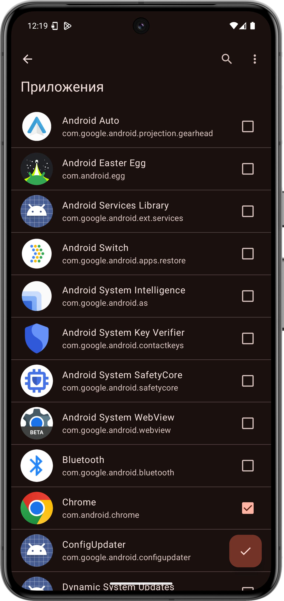

# Как использовать Блокировку приложений
## Что такое Блокировка приложений?
Блокировка приложений - это функция, предназначенная для защиты ваших приложений от несанкционированного доступа. 
При попытке открыть любое защищённое приложение, потенциальный мошенник увидит фальшивое сообщение о сбое:

> [!NOTE]
> Для работы Блокировки приложений требуется разрешение спец. возможностей.
> Оно нужно для получения информации о текущем окне (приложении), и если оно в списке защищённых, закрыть его
> и показать фальшивое сообщение о сбое.

## Как войти в заблокированное приложение?
Для входа в заблокированное приложение зажмите кнопку **О приложении**.
Дальше нужно ввести пароль для входа в приложение:

Если Вы введёте правильный пароль, приложение откроется.

> <!-- ### Важно -->
> [!IMPORTANT]
> Пароль по умолчанию **пустой**. Поэтому, если Вы не устанавливали пароль ранее или сами установили пустой пароль, нужно оставлять поле для ввода пароля пустым и просто нажимать **ОК**. 

## Как включить эту функцию?
> <!-- ### Совет -->
> [!TIP]
> Чтобы улучшить работу Блокировки приложений, включите опцию **Служба переднего плана для специальных возможностей**.
> Она будет держать работу функции до перезагрузки.
> К сожалению, вам придётся повторить инструкцию после перезагрузки из-за ограничений Android.
> 
> Чтобы отключить постоянное уведомление, нажмите и удерживайте его, а затем нажмите **Выключить уведомления**:
> 
>    src="../res/guides/how_to_lock_apps/notification.png"
>   alt="Выключение постоянного уведомления"
>   width="293,8"
>   height="620,8"
>   class="phone" />

### Инструкция
1. Зайдите в Toolbox.io и перейдите в раздел [**Блокировка приложений**](toolbox-io://page/applocker).
   
   
2. Нажмите на переключатель **Включить** вверху.
3. Предоставьте разрешение спец. возможностей:
   
   
   
4. Если Toolbox.io не откроется, повторите инструкцию.
5. Выберите приложения, которые нужно защитить через пункт **Приложения** на странице Блокировки приложений:
   
   
6. Нажмите на галочку в правом нижнем углу.

Готово! Теперь ваши приложения надёжно защищены Блокировкой приложений.

