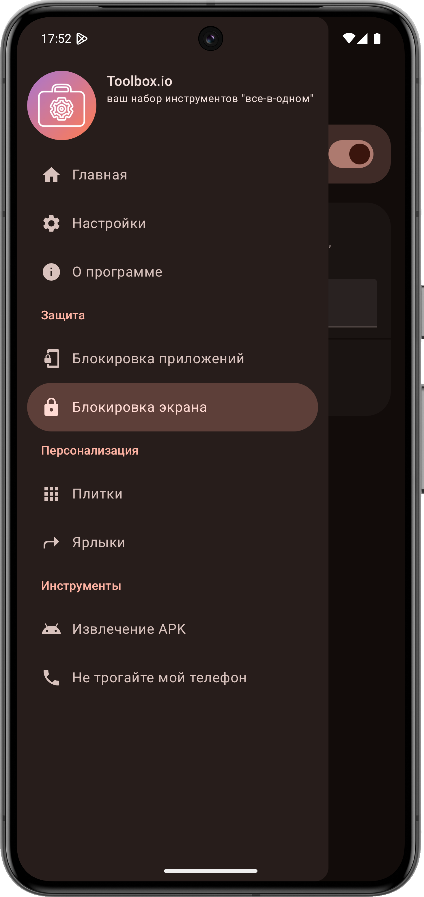
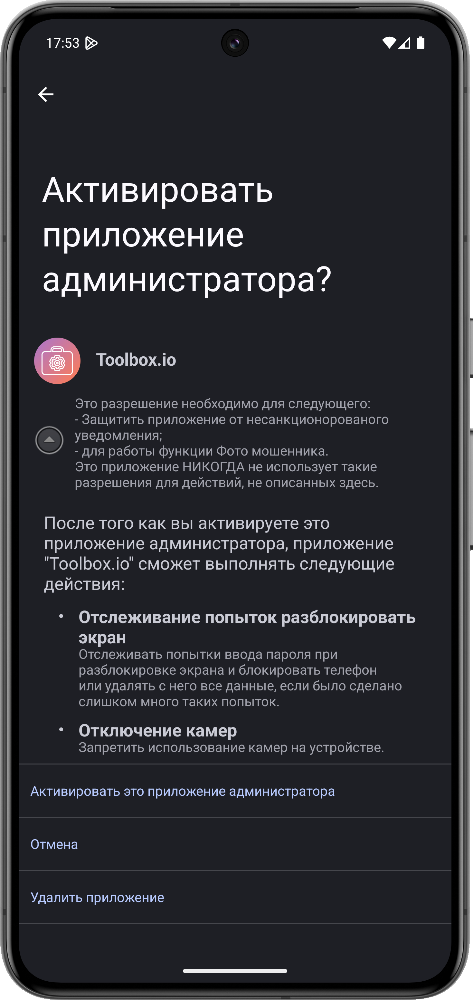

# Как использовать Блокировку экрана
## Что это такое?
Блокировка экрана - это очередная функция защиты Toolbox.io, защищающая вас от физических мошенников.
Она позволяет выполнять определённые действия при нескольких неудачных попытках разблокировать экран,
такие как фотографирование злоумышленника, сигнализация и т. д.

> [!NOTE]
> Для работы Блокировки экрана требуется разрешение администратора устройства.
> Оно нужно для счёта и обнаружения неудачных попыток разблокировки экрана и выполнения
> нужных действий.

## Какие действия можно настроить?
- **Сигнализация.** Проигрывает звук сигнализации (его можно настроить при желании) на 100%
  громкости, которую невозможно изменить.

- **Фотография злоумышленника.** Незаметно фотографирует того, кто пытался разблокировать зкран с
  фронтальной камеры.
  > [!IMPORTANT]
  > На Android 12 и выше, к сожалению, будет видна зелёная точка в верхнем правом углу экрана.
  > Это не проблема приложения.

## Как настроить?
1. Откройте Toolbox.io и перейдите в раздел [Блокировка экрана](toolbox-io://page/unlockProtection).
   
   
2. Нажмите на **Включить** вверху экрана и предоставьте разрешение администратора устройства на 
   следующем экране.
   
   
3. Откройте **Действия** и включите требуемые действия.

Готово! Теперь ваш телефон надёжно защищён с Toolbox.io.